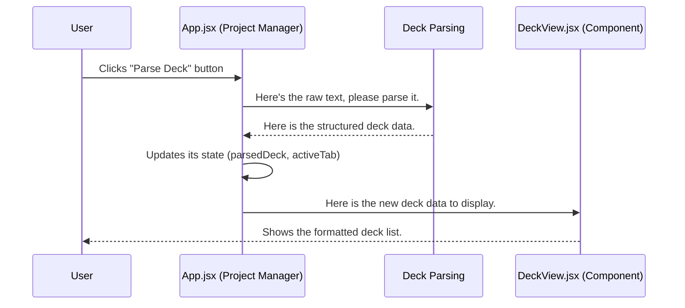

# Chapter 1: UI & State Orchestration

Welcome to the `mtg-goldfisher` project! We're excited to have you on board. This series of tutorials will walk you through the core concepts of the application, one piece at a time. Let's start with the most important part: the application's central nervous system.

## The Project Manager

Imagine you want to test a new Magic: The Gathering deck. You open the app, paste your decklist into a text box, and click a button. Magically, your deck appears in a nicely formatted list, and you're ready to run simulations.

But what happens behind the scenes? What connects your click to the code that reads the decklist? What holds onto that decklist so other parts of the app can use it?

This is where **UI & State Orchestration** comes in. In our project, this all happens inside the `src/App.jsx` file. Think of `App.jsx` as the **Project Manager** of a construction site.

*   It doesn't lay bricks itself (that's the [Game Simulation Engine](04_game_simulation_engine_.md)).
*   It doesn't design the building (that's the [AI-Powered Strategic Analysis](03_ai_powered_strategic_analysis_.md)).
*   It presents the finished building to you (using UI Components like `DeckView`).

Instead, the Project Manager's job is to **coordinate everything**. It holds the master blueprint (the application's data) and tells all the specialized workers what to do and when. This ensures every part of the application works together smoothly.

## Key Concepts

Let's break this down into two simple ideas: **State** and **UI Components**.

### What is "State"?

**State** is just a fancy word for the application's memory. It's all the important information the app needs to remember at any given moment.

Imagine you're playing a video game. Your character's health, inventory, and location are all part of the game's "state." When you save the game, you're saving that state.

In our app, the state includes:
*   The raw decklist text you pasted.
*   The parsed, structured version of your deck.
*   The results of the AI's analysis.
*   The statistics from your game simulations.

In React (the library we use to build the interface), we use a special tool called `useState` to create these pieces of memory.

```javascript
// src/App.jsx

// Create a piece of memory called `deckList` to hold the raw text.
// `setDeckList` is the *only* way to change it.
const [deckList, setDeckList] = useState('');
```
This one line of code creates a "state variable." It gives us `deckList` to read the data and a function `setDeckList` to update it.

### What are UI Components?

**UI Components** are the visual building blocks of our application. They are the things you see and interact with. The input text area, the buttons, and the view that displays your deck cards are all components.

Our Project Manager, `App.jsx`, decides which components to show and gives them the data they need from the **state**. For example, it tells the `DeckView` component, "Here is the parsed deck data; please display it to the user."

## How It Solves Our Use Case

Let's walk through our simple example—pasting a deck and seeing it displayed—to understand how orchestration works.

**Step 1: You type your deck into the text area.**

As you type, the text area component calls `setDeckList` to update the `deckList` state variable with the latest text. The Project Manager now "remembers" what you've typed.

```jsx
// src/App.jsx

// The `onChange` event updates the state every time you type.
<textarea
  value={deckList}
  onChange={(e) => setDeckList(e.target.value)}
  // ...other properties
/>
```
This links your typing directly to the application's memory.

**Step 2: You click the "Parse Deck List" button.**

Clicking the button triggers a function inside `App.jsx` called `handleParseDeck`. This is where the orchestration happens!

```jsx
// src/App.jsx

// This button's `onClick` is connected to our orchestrator function.
<button onClick={handleParseDeck}>
  Parse Deck List
</button>
```

**Step 3: The `handleParseDeck` function coordinates the work.**

This function acts like a checklist for the Project Manager:

1.  **Delegate:** It calls on a specialist, the `parseDeckList` function, to do the hard work of converting the raw text into structured data. We'll learn more about this in the [Deck Data Ingestion & Parsing](02_deck_data_ingestion___parsing_.md) chapter.
2.  **Update State:** It takes the result from the specialist and saves it to a *new* piece of state called `parsedDeck`.
3.  **Update the View:** It updates another piece of state, `activeTab`, to tell the application, "Okay, stop showing the input form and start showing the deck view."

```javascript
// src/App.jsx

const handleParseDeck = async () => {
  // 1. Delegate the parsing job
  const parsed = await parseDeckList(commanderList, deckList);
  
  // 2. Update state with the result
  setParsedDeck(parsed);
  
  // 3. Change the view for the user
  setActiveTab('deck');
};
```
Because the state was updated, React automatically re-renders the screen, showing the `DeckView` component with the newly parsed deck information. It all happens seamlessly!

## Under the Hood

Let's visualize that flow of information.



The core of this system lies in how `App.jsx` manages its state variables and passes them down to child components.

### Holding the Blueprints (State)

`App.jsx` declares all the critical pieces of information at the very top. This centralization is key to its role as an orchestrator.

```javascript
// src/App.jsx

// Raw text from the user
const [deckList, setDeckList] = useState('');
// Structured data after parsing
const [parsedDeck, setParsedDeck] = useState(null);
// AI analysis results
const [aiAnalysis, setAiAnalysis] = useState(null);
// Which screen to show the user
const [activeTab, setActiveTab] = useState('input');
```
By keeping all the important data in one place, we avoid confusion and ensure that every part of the app is working with the same, up-to-date information.

### Passing Instructions (Props)

When `App.jsx` decides to show a component, it passes the data that component needs as "props" (short for properties). This is like the project manager handing a blueprint to a construction crew.

```jsx
// src/App.jsx

// If the active tab is 'deck' AND a deck has been parsed...
{activeTab === 'deck' && parsedDeck && (
  // ...then show the DeckView component.
  <DeckView parsedDeck={parsedDeck} deckStrategy={deckStrategy} />
)}
```
Here, we pass the `parsedDeck` state down to the `DeckView` component. `DeckView` doesn't need to know *how* the deck was parsed; it only needs the final data to do its job of displaying it. This separation of concerns makes our code much cleaner and easier to manage.

## Conclusion

You now understand the most fundamental concept of `mtg-goldfisher`: `App.jsx` acts as the central **orchestrator**. It uses **state** to remember crucial information and handler functions to coordinate tasks between the user interface and the powerful backend engines. This structure allows us to build complex features while keeping the overall application logic organized and predictable.

With this foundation in place, we're ready to look at the first specialist our Project Manager calls upon.

Next up, we'll explore how we take the simple text you paste and turn it into a structured list of cards that our application can actually work with.

➡️ **Next Chapter: [Deck Data Ingestion & Parsing](02_deck_data_ingestion___parsing_.md)**

---

Generated by [AI Codebase Knowledge Builder](https://github.com/The-Pocket/Tutorial-Codebase-Knowledge)