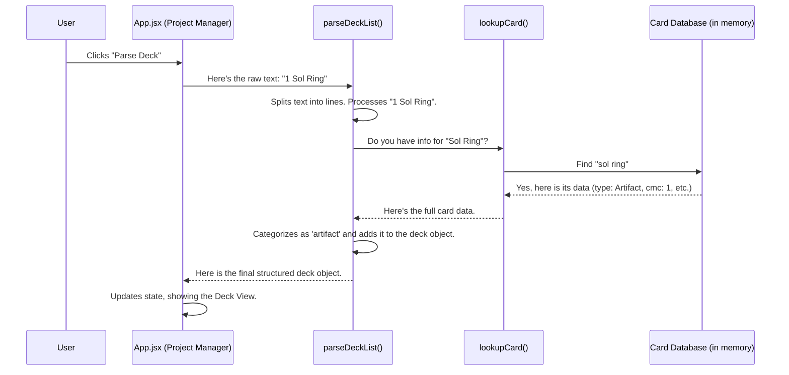

# Chapter 2: Deck Data Ingestion & Parsing

In the [previous chapter on UI & State Orchestration](01_ui___state_orchestration_.md), we saw how our "Project Manager" (`App.jsx`) takes your raw decklist text when you click a button. But that raw text is like a grocery list scribbled on a napkin—our application can't understand it yet. It doesn't know that "Sol Ring" is an artifact or that "Island" is a land.

This chapter is about the first specialist the Project Manager hires: the **Librarian**. This specialist's job is to take that scribbled list, look up every single item in a giant encyclopedia of Magic cards, and organize them into a neat, structured format that the rest of the application can easily use.

## The Core Problem: From Plain Text to Smart Data

Imagine you give the app this text:

```text
1 Sol Ring
10 Swamp
```

To a human, this is simple. To a computer, it's just a sequence of letters and numbers. It has no idea that "Sol Ring" costs 1 mana or that a "Swamp" produces black mana.

The goal of **Deck Data Ingestion & Parsing** is to solve this problem. We need to convert that simple text into a rich, structured object that looks something like this (simplified):

```javascript
{
  artifacts: [
    { name: "Sol Ring", cmc: 1, type_line: "Artifact", ... }
  ],
  lands: [
    { name: "Swamp", quantity: 10, type_line: "Basic Land — Swamp", ... }
  ]
  // ...and so on for creatures, sorceries, etc.
}
```

This structured format is the foundation for everything else in the app, from showing you a pretty deck view to running complex game simulations.

## Our Librarian's Three-Step Process

Our "Librarian" is a function called `parseDeckList` inside `App.jsx`. It follows a simple, repeatable process for every decklist it receives.

### Step 1: Loading the "Card Catalog"

Before a librarian can look up any books, they need a card catalog! In our app, the card catalog is a massive CSV file containing data for thousands of Magic cards.

When the application first starts, it reads this entire file and stores it in memory. This happens only once, so it's ready to go whenever you want to parse a deck.

```javascript
// src/App.jsx

// This runs once when the app loads.
React.useEffect(() => {
  // 1. Fetch the big CSV file with all card data.
  const csvData = await fetch('/data/Full card data.csv');
  
  // 2. Use a library to parse the text into rows.
  const parsed = Papa.parse(csvData, { header: true });
  
  // 3. Store it in a way we can access cards by name quickly.
  setCardDatabase(cardMap); 
}, []);
```
This prepares our application with all the knowledge it needs, just like a librarian setting up their reference desk for the day.

### Step 2: Reading Each Line of the List

Next, our `parseDeckList` function takes the raw text from the input box and splits it into individual lines. It then looks at each line to figure out two things: the **quantity** and the **card name**.

```text
1x Arcane Signet
```

It uses a simple pattern-matching tool called a "Regular Expression" to understand that "1" is the quantity and "Arcane Signet" is the name.

```javascript
// A helper function inside parseDeckList

const processLine = (line) => {
  // This pattern finds the number and the name
  const match = line.match(/^(\d+)x?\s+(.+)$/);
  
  const cardName = match ? match[2] : line; // "Arcane Signet"
  const quantity = match ? parseInt(match[1]) : 1; // 1
  
  // ... now we can look up the cardName!
};
```
This is like the librarian reading one line of your handwritten list at a time.

### Step 3: Looking Up & Sorting the Card

Once we have the card's name, we can look it up in the "Card Catalog" we loaded in Step 1.

```javascript
// src/App.jsx

const lookupCard = (cardName) => {
  if (!cardDatabase) return null;
  // Find the card in our database using its name
  return cardDatabase[cardName.toLowerCase().trim()];
};
```
If we find a match, we get all of its data (mana cost, type, text, etc.). The final step is to figure out *what kind* of card it is (Creature, Land, Artifact?) and place it in the correct category in our final deck object.

```javascript
// src/App.jsx

const categorizeCard = (type) => {
  if (type.includes('Creature')) return 'creature';
  if (type.includes('Land')) return 'land';
  // ... and so on for other types
  return 'unknown';
};
```
This is like the librarian finding the book in the catalog, grabbing it from the shelf, and putting it on the correct "Creatures" or "Lands" cart to be checked out.

## Under the Hood: A Step-by-Step Flow

Let's visualize the entire journey from your click to a fully parsed deck. The Project Manager (`App.jsx`) initiates the process, but the real work happens inside the parsing and lookup functions.



### The Code in Action

Let's connect this flow back to the code you saw in Chapter 1. The `handleParseDeck` function is the trigger.

```javascript
// src/App.jsx

const handleParseDeck = async () => {
  // Here's the call to our "Librarian"!
  const parsed = await parseDeckList(commanderList, deckList);
  
  // Save the structured result to the app's memory (state)
  setParsedDeck(parsed);
  
  // Tell the app to show the deck view tab
  setActiveTab('deck');
};
```

The `parseDeckList` function takes the raw text and returns the beautiful, structured object. `handleParseDeck` then takes that result and saves it, causing the user interface to update automatically and show you your formatted deck.

This separation is crucial:
*   **`handleParseDeck`** is the coordinator; it knows *when* to parse the deck.
*   **`parseDeckList`** is the specialist; it knows *how* to parse the deck.

## Conclusion

You've now seen how `mtg-goldfisher` transforms a simple copy-pasted block of text into a powerful, data-rich object that the application can truly understand. This process of **ingestion and parsing** is the critical entry point for all data. It's the librarian who brings order to chaos, creating a perfectly organized cart of books from a messy, handwritten list.

With this clean, structured deck data in hand, we can now do some amazing things. What's the first thing we'll do with it? We'll hand it over to another specialist—an AI strategist—to figure out what your deck is trying to do.

➡️ **Next Chapter: [AI-Powered Strategic Analysis](03_ai_powered_strategic_analysis_.md)**

---

Generated by [AI Codebase Knowledge Builder](https://github.com/The-Pocket/Tutorial-Codebase-Knowledge)