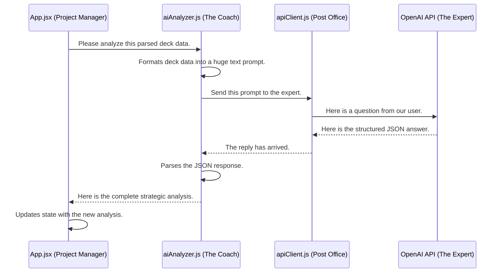

# Chapter 3: AI-Powered Strategic Analysis

In the [previous chapter](02_deck_data_ingestion___parsing_.md), we learned how our "Librarian" takes a plain text decklist and turns it into a neatly organized, structured object. We now have a list of cards, categorized and full of data.

But this is like having a list of all the parts for a car—you have the engine, the wheels, and the chassis, but you don't have the instruction manual. You don't know what the car is *designed to do*. Is it a race car? An off-road truck? A family minivan?

This chapter is about creating that instruction manual. We're going to hire a world-class expert, an **AI Coach**, to look at our parts list and write a complete strategic playbook for our deck.

## The Core Problem: From a Card List to a Game Plan

Our application knows we have "Sol Ring" and "Arcane Signet." It knows these are artifacts that produce mana. But it doesn't understand the *concept* of "ramp." It doesn't know that our deck's strategy might be to play big, expensive creatures ahead of schedule.

The goal of **AI-Powered Strategic Analysis** is to bridge this gap. We take the structured deck data and ask a powerful Large Language Model (like GPT-4o-mini) to analyze it, just like a human expert would.

Imagine you give your deck to a professional Magic: The Gathering coach. They don't just look at the cards; they tell you:
*   What your deck's main **win conditions** are.
*   The key **synergies** between your cards.
*   What a good **opening hand** looks like.
*   What the deck's biggest **weaknesses** are.

This is exactly what our AI Coach does. It provides the "brain" for our application.

## Our AI Coach's Three-Step Process

Our AI Coach is a function called `analyzeWithAI` located in `src/aiAnalyzer.js`. It's responsible for communicating with the external AI. Here’s how it works.

### Step 1: Writing the Question (The Prompt)

We can't just send a list of cards to the AI. We need to frame our request carefully. We have to assemble all the deck information into a single, detailed question called a **prompt**.

This prompt is like a formal letter to our coach. It includes:
*   The commander's name.
*   A summary of the deck (how many creatures, lands, etc.).
*   A list of all the cards.
*   A very specific request for the type of analysis we want, and a demand that the response be in a structured JSON format.

```javascript
// A simplified version of our prompt

const prompt = `
  You are an expert MTG analyst. Analyze this deck:

  Commander: Tatyova, Benthic Druid
  Creatures: 25, Lands: 40, Spells: 34

  Please provide:
  1. The top 3 win conditions.
  2. The deck's main weaknesses.

  Format your response as structured JSON.
`;
```
By being extremely clear in our prompt, we guide the AI to give us exactly the information we need, in the format we need it.

### Step 2: Sending the Question (The API Call)

Once the prompt is ready, we need to send it to the AI service. This happens in a helper module, `src/apiClient.js`, which contains a function called `callOpenAI`.

Think of this function as the **Post Office**. It takes our carefully written letter (the prompt), sends it across the internet to the AI's servers, and waits for a reply.

```javascript
// src/aiAnalyzer.js

// 1. The prompt is created with all the deck data...
const prompt = createDeckAnalysisPrompt(parsedDeck);

// 2. We use our "Post Office" to send it and get a reply.
const analysis = await callOpenAI(prompt);
```
This simple function call hides all the complexity of network requests and authentication. It just sends the question and returns the answer.

### Step 3: Reading the Answer (Parsing the Response)

The AI doesn't just send back a casual paragraph. Because we asked for it in the prompt, it sends back a perfectly structured JSON object.

This is the expert report from our coach, neatly organized into sections we can easily understand and use.

**Example AI Response (Output):**
```json
{
  "archetype": "Landfall / Ramp",
  "winConditions": [
    "Generate overwhelming value with Tatyova and card draw.",
    "Create a massive army of creature tokens.",
    "Mill the opponent out with incidental effects."
  ],
  "weaknesses": [
    "Vulnerable to early aggression.",
    "Relies heavily on the commander staying on the board."
  ]
}
```
Our application can now read this data directly and save it to its memory (state). It now *knows* the deck's strategy, strengths, and weaknesses.

## Under the Hood: A Step-by-Step Flow

Let's visualize the journey from a parsed deck to a full strategic analysis. The Project Manager (`App.jsx`) kicks things off, but the AI Analyzer and API Client do all the heavy lifting.



### The Code in Action

The code that powers this is surprisingly straightforward, because we've broken the problem into small, manageable pieces.

The core logic lives in `src/aiAnalyzer.js`. The main function takes the `parsedDeck` we created in the last chapter.

```javascript
// src/aiAnalyzer.js

// This is the internal implementation of our AI analyzer.
const analyzeWithAIImpl = async (parsedDeck, basicStrategy) => {
  // A long, detailed prompt is built using the deck data.
  // (We've simplified this part for the tutorial)
  const prompt = `You are an expert... Analyze this deck: ...`;

  // It calls our API client to do the communication.
  const analysis = await callOpenAI(
    [
      // ... system and user messages
      { role: 'user', content: prompt }
    ]
  );
  
  // The function returns the structured analysis from the AI.
  return { analysis };
};
```
This function's only job is to prepare the question and hand it off. The `callOpenAI` function in `src/apiClient.js` handles the actual web request.

### What if the Coach is Busy? (Fallbacks)

What happens if the OpenAI API is down or our internet connection fails? Our app doesn't just crash. We have a backup plan!

The `analyzeWithAI` function is wrapped in a special helper that provides a **fallback**. If the real AI call fails, it runs a much simpler, non-AI function instead.

```javascript
// src/aiAnalyzer.js

// If the AI fails, this simple function runs instead.
const analyzeWithAIFallback = async (parsedDeck, basicStrategy) => {
  console.warn('⚠️ AI analysis failed, using basic strategy');
  
  // It returns a very basic, pre-written analysis.
  return {
    analysis: {
      archetype: basicStrategy.archetype,
      winConditions: ['Combat damage'],
      // ... other basic fields
    },
    usedFallback: true
  };
};
```
This ensures our application is resilient and can still provide a decent user experience even when external services fail. We'll learn more about this in the chapter on [Robust Error Handling & Fallbacks](08_robust_error_handling___fallbacks_.md).

## Conclusion

You now understand the "brain" of `mtg-goldfisher`. By creating a detailed **prompt**, sending it to an external AI via an **API call**, and parsing the structured **response**, we transform a simple list of cards into a deep, actionable strategic playbook. This playbook gives our application the expert-level knowledge it needs to make smart decisions.

But what's the point of having a playbook if you never run the plays? Now that we know our deck's strategy, it's time to put it to the test.

➡️ **Next Chapter: [Game Simulation Engine](04_game_simulation_engine_.md)**

---

Generated by [AI Codebase Knowledge Builder](https://github.com/The-Pocket/Tutorial-Codebase-Knowledge)