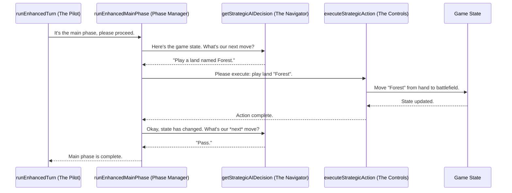

# Chapter 4: Game Simulation Engine

In the [previous chapter on AI-Powered Strategic Analysis](03_ai_powered_strategic_analysis_.md), our "AI Coach" handed us a detailed playbook for our deck. We now know our win conditions, key synergies, and what an ideal game should look like.

But a playbook is just a theory. How do we know if it actually works? How does the deck *feel* when you play it? Does it get enough lands? Does it run out of cards?

This is where the heart of `mtg-goldfisher` comes in: the **Game Simulation Engine**. This chapter is about the virtual player that takes our deck and our AI's playbook and actually plays a game of solitaire, or "goldfishes," to test everything out.

## The Core Problem: From a Plan to a Performance

Imagine you've designed a new airplane. You have the blueprints (the parsed deck) and a detailed flight plan (the AI analysis). But you wouldn't put a real pilot in it for the first flight. You'd use a **flight simulator**.

The flight simulator's job is to:
1.  Set up a virtual cockpit with all the controls (the game state).
2.  Follow the rules of physics and aerodynamics (the rules of Magic).
3.  Execute the flight plan step-by-step, making small adjustments as needed (playing lands, casting spells).
4.  Log every single action for later review.

Our Game Simulation Engine does exactly this for your Magic deck. It's a sophisticated flight simulator that takes your deck design for a test flight to see how it performs under standard conditions.

## The Simulator's Three Key Components

Our main flight simulator is located in `src/enhancedStepByStepGame.js`. To understand how it works, let's break it down into three simple ideas.

### 1. The Game State: The Cockpit's Dashboard

The **Game State** is the memory of a single game. It's a large JavaScript object that keeps track of everything, just like a pilot's dashboard.

At any given moment, the game state knows:
*   How many cards are in your library.
*   Which cards are in your hand.
*   Which permanents are on the battlefield.
*   How much mana you have.
*   What turn it is.

```javascript
// A simplified view of the game state object
const gameState = {
  turn: 3,
  phase: 'main1',
  hand: [ { name: 'Sol Ring' }, { name: 'Forest' } ],
  battlefield: {
    lands: [ { name: 'Island' }, { name: 'Swamp' } ]
  },
  // ...and much more
};
```
Every action the engine takes—drawing a card, playing a land—is just a function that updates this central game state object.

### 2. The Turn Loop: Following the Rules of the Game

A game of Magic follows a strict sequence: Untap, Upkeep, Draw, Main Phase, etc. Our engine follows these rules perfectly. The main "pilot" function, `runEnhancedTurn`, acts like a pre-flight checklist for each turn.

```javascript
// src/enhancedStepByStepGame.js (simplified)

export const runEnhancedTurn = async (game) => {
  game.turn++;

  // 1. Untap everything and generate mana
  untapPhase(game);
  generateMana(game);

  // 2. Draw a card for the turn
  drawCard(game);

  // 3. Make decisions in the first main phase
  await runEnhancedMainPhase(game);

  // 4. Attack!
  combatPhase(game);
  
  // ... and so on
  return game;
};
```
This function doesn't decide *what* to play; it just ensures the game moves through the correct phases in the correct order. It enforces the rules of Magic.

### 3. AI-Powered Decisions: Following the Flight Plan

So, who decides what to do during the main phase? This is where our AI Coach's playbook from Chapter 3 comes in. During the main phase, the engine enters a loop. In each step of the loop, it does the following:

1.  It bundles up the *current* game state (hand, mana, battlefield).
2.  It sends that information to the AI, along with the strategic playbook.
3.  It asks a simple question: **"Given the state of the game and our strategy, what is the single best action to take right now?"**
4.  The AI responds with a single action, like `"castSpell"` with the target `"Sol Ring"`.
5.  The engine executes that one action, updates the game state, and repeats the loop until the AI says `"pass"`.

```javascript
// src/enhancedStepByStepGame.js (simplified)

const runEnhancedMainPhase = async (game) => {
  while (true) {
    // 1. Ask the AI what to do
    const aiResponse = await getStrategicAIDecision(game);
    const decision = aiResponse.decision;

    // 2. If the AI says to pass, we're done
    if (decision.action === 'pass') {
      break;
    }

    // 3. Otherwise, execute the AI's chosen action
    executeStrategicAction(game, decision);
  }
  return game;
};
```
This loop is the core of the simulation. The engine handles the rules, and the AI provides the strategy, turn by turn, action by action.

## Under the Hood: A Step-by-Step Flight

Let's trace a single decision within a turn to see how all the pieces work together.



The engine is a conversation. The `runEnhancedMainPhase` function acts as a manager, constantly checking with the AI "navigator" for the next instruction and telling the `executeStrategicAction` function to manipulate the "controls" of the game state.

### The Code in Action

The process starts when our main application component calls the top-level simulation function.

```javascript
// src/App.jsx

// This function is called when you click "Run Simulation"
const handleRunSimulation = async () => {
  // It calls our "flight simulator" with the deck, strategy, and AI analysis
  const gameResult = await runEnhancedDetailedGame(
    parsedDeck,
    deckStrategy,
    aiAnalysis,
    // ... other options
  );
  // ... then saves the results
};
```

Inside `runEnhancedDetailedGame`, a loop runs for the desired number of turns, calling `runEnhancedTurn` for each one. The real magic happens inside the `getStrategicAIDecision` function, where a massive prompt is built to ask the AI for its decision.

This prompt contains everything: the deck's strategy, the current hand, the battlefield, and very specific instructions on how to respond. The function then sends this off to the AI.

```javascript
// src/enhancedStepByStepGame.js (simplified)

const getStrategicAIDecision = async (game) => {
  // 1. Build a huge text prompt with all game info
  const prompt = `
    You are an expert Magic player.
    Turn: ${game.turn}
    Hand: ${JSON.stringify(game.hand)}
    Battlefield: ${JSON.stringify(game.battlefield)}
    Strategy: ${game.aiAnalysis.analysis.overallStrategy}
    
    What is the single best action to take now?
    Respond with JSON: { "action": "...", "target": "..." }
  `;

  // 2. Call the AI and wait for the structured response
  const decision = await callOpenAI(prompt);
  return { success: true, decision };
};
```
By giving the AI a complete picture of the game *and* the high-level strategy, it can make intelligent, context-aware decisions that a simple, rule-based engine never could.

## Conclusion

You now understand the core of `mtg-goldfisher`'s functionality. The **Game Simulation Engine** acts as a virtual player that meticulously simulates a game of Magic. It combines a strict adherence to the game's turn structure with the flexible, strategic guidance of an AI. This powerful combination allows us to test a deck's performance and generate a detailed log of every action for later analysis.

However, the engine itself doesn't know what "Scry 2" means or how to create a Treasure token. To handle the thousands of unique card abilities in Magic, it relies on a library of specialists.

➡️ **Next Chapter: [Modular Game Mechanics](05_modular_game_mechanics_.md)**

---

Generated by [AI Codebase Knowledge Builder](https://github.com/The-Pocket/Tutorial-Codebase-Knowledge)