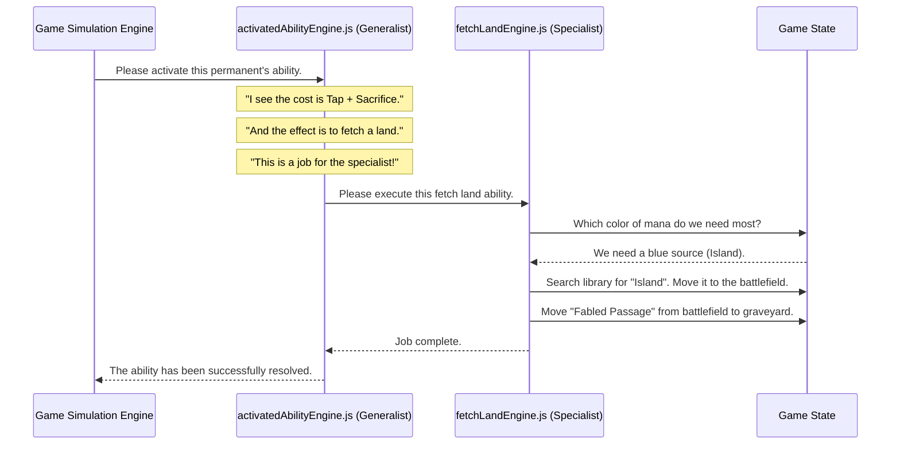

# Chapter 5: Modular Game Mechanics

In the [previous chapter on the Game Simulation Engine](04_game_simulation_engine_.md), we saw our virtual "pilot" fly the deck through a game, making decisions with the help of an AI. But we glossed over a huge detail: How does the engine know what "Scry 2" actually *means*? Or how to create a Treasure token? Or what happens when you sacrifice a fetch land?

Magic: The Gathering has thousands of unique keywords and abilities. If we tried to write code for all of them inside our main simulation engine, it would become a single, million-line file that would be impossible to read, debug, or update. It would be like building a car where the engine, wheels, radio, and air conditioning are all welded into one giant block of metal. Fixing one thing would risk breaking everything else.

This chapter is about our solution: a team of highly specialized experts. Instead of one giant block of code, we have **Modular Game Mechanics**.

## The Core Problem: Taming a Universe of Rules

Let's take a simple card ability: **Landcycling**. When you have a card with "Islandcycling" in your hand, you can pay a mana cost, discard the card, and search your library for an Island.

Our main game engine shouldn't have to know the specific steps for this. Its job is to manage the turn and ask the AI for high-level decisions. It needs to be able to delegate the nitty-gritty work.

The goal of our modular approach is to create a dedicated "engine" file for each specific game mechanic. We have:
*   A **Scry Engine** that only knows how to look at the top of the library and put cards on the top or bottom.
*   A **Token Engine** that is an expert at creating creature and artifact tokens.
*   A **Fetch Land Engine** that knows all about sacrificing lands to find new ones.
*   An **Activated Ability Engine** that acts as a general manager for abilities with a "cost: effect" structure.

This is like a well-organized workshop. Instead of one person trying to be an expert in everything, we have a specialist for electronics, one for painting, and one for the engine. When a complex job comes in, they work together, each handling their part.

## Our Specialists in Action

Let's see how this solves a simple use case: The AI decides it's a good time to use the ability of "Fabled Passage," a fetch land, to find a basic land.

### 1. The Generalist: The Activated Ability Engine

The main simulation engine sees the AI wants to use an ability. It hands the task to our generalist specialist, the **Activated Ability Engine** (`src/activatedAbilityEngine.js`). This engine is great at understanding abilities that look like `Cost: Effect`.

For Fabled Passage, the ability is: `{T}, Sacrifice Fabled Passage: Search your library for a basic land card...`

The `activatedAbilityEngine.js` knows how to handle the basics: paying the cost by tapping (`{T}`) and sacrificing the card. But searching the library for a specific type of land is a very specialized job.

### 2. The Specialist: The Fetch Land Engine

The Activated Ability Engine is smart enough to recognize when it's out of its depth. It sees that the effect is to "search your library for a basic land card" and realizes this is a job for an even more focused expert: the **Fetch Land Engine** (`src/fetchLandEngine.js`).

It delegates the task, and the `fetchLandEngine.js` takes over. This specialist knows everything about fetching lands:
*   How to analyze the game state to see which color of mana is needed most.
*   How to search the library for the correct land.
*   How to put the new land onto the battlefield tapped.
*   How to move the sacrificed fetch land to the graveyard.

It completes all these steps perfectly and reports back that the job is done. The main simulation engine never needed to know any of those details.

## Under the Hood: A Chain of Command

Let's visualize how this delegation works when the simulator decides to activate a fetch land that's on the battlefield.



This clean chain of command keeps each module simple and focused on a single responsibility.

### The Code in Action

Let's look at a simplified piece of code from the "Generalist," the `activatedAbilityEngine.js`. When it's asked to activate an ability from the battlefield, it has a special check right at the top.

```javascript
// src/activatedAbilityEngine.js (simplified)

export const activateAbilityFromBattlefield = (gameState, permanent) => {
  // ... code to parse the ability ...
  const ability = parseActivatedAbilities(permanent)[0];
  
  // Is this a special case that needs an expert?
  if (ability.isFetchLand) {
    console.log("FETCH LAND DETECTED! Calling the specialist...");
    
    // Delegate the entire job to the Fetch Land Engine
    return executeSingleFetchLand(gameState, permanent);
  }
  
  // If not, handle it with generic logic here...
};
```
This `if` statement is the crucial hand-off. The generalist identifies the specific type of job and calls the correct specialist, `executeSingleFetchLand`, to handle it.

The specialist, `fetchLandEngine.js`, then performs its focused task.

```javascript
// src/fetchLandEngine.js (simplified)

export const executeSingleFetchLand = (game, fetchLand) => {
  // 1. Analyze the game to choose the best land
  const choice = chooseBestBasicLand(game);
  
  // 2. Search the library for that land
  const foundLand = searchForBasicLand(game, choice.landName);
  
  // 3. Update the game state:
  //    - Move fetch land to graveyard
  //    - Move found land to battlefield
  //    - Log everything
  
  return game; // Return the updated game state
};
```
Each engine has a clearly defined role. If we ever need to improve our logic for choosing which land to fetch, we only need to edit one small function inside `fetchLandEngine.js`. The rest of the application remains untouched and safe.

## Conclusion

You now understand one of the most important architectural principles of `mtg-goldfisher`: **modularity**. By breaking down Magic's complex rules into small, self-contained "engine" files, we create a system that is:
*   **Easy to Understand:** You only need to look at `scryEngine.js` to understand how scrying works.
*   **Easy to Test:** We can test the token engine in isolation without needing to run a full game simulation.
*   **Easy to Extend:** Adding a new mechanic, like "Suspend," is as simple as creating a new `suspendEngine.js` file and teaching the main simulator to call it at the right time.

These engines know *how* to execute a mechanic like scrying or creating a token. But how does the application know that a specific card, like "Preordain," *has* a scry ability in the first place? For that, we need another layer of analysis.

➡️ **Next Chapter: [Dynamic Card Behavior Analysis](06_dynamic_card_behavior_analysis_.md)**

---

Generated by [AI Codebase Knowledge Builder](https://github.com/The-Pocket/Tutorial-Codebase-Knowledge)