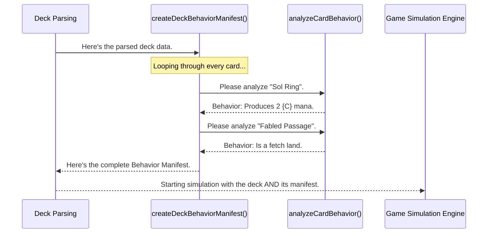

# Chapter 6: Dynamic Card Behavior Analysis

In the [previous chapter on Modular Game Mechanics](05_modular_game_mechanics_.md), we saw how our Game Simulation Engine delegates complex jobs to specialists. When it encounters a card like "Fabled Passage," it knows to call the `fetchLandEngine.js` to handle the specific rules of searching for a land.

But that raises a critical question: how did the engine know that "Fabled Passage" was a fetch land in the first place? It's not in the card's name. We could create a giant list of every fetch land ever printed, but this would be a nightmare to maintain. Every time a new Magic set came out, we'd have to update our code.

This chapter is about a much smarter solution. Instead of memorizing every card's name, we've built a system that can *read* a card's instruction manual (its rules text) and figure out what it does on its own.

## The Core Problem: From Card Text to Card Function

Imagine you buy a new piece of electronics. You don't know what the buttons do. You have two options:
1.  Find someone who has memorized what every button on every device ever made does. (This is like hardcoding card names.)
2.  Read the instruction manual that came with it. (This is what our system does.)

**Dynamic Card Behavior Analysis** is our universal instruction manual reader. It scans the rules text of any Magic card—even one it has never seen before—and identifies its key functions.

For example, when it sees the text for "Sol Ring":
`{T}: Add {C}{C}.`

It doesn't need to know the card is named "Sol Ring." It sees the pattern `"Add {C}{C}"` and immediately understands: "This card produces two colorless mana."

This approach makes our simulation engine incredibly powerful and adaptable. It can understand thousands of cards, including brand new ones, without ever needing a code update.

## The Analyzer's Simple Process

Our universal translator is a collection of functions inside `src/cardBehaviorAnalyzer.js`. The main function is `analyzeCardBehavior`. For every card, it acts like a detective, looking for clues in the rules text.

### Step 1: Look for Keywords

The process is based on simple pattern matching. The analyzer has a list of keywords it looks for. Let's see how it would analyze a few different cards.

**Card 1: Llanowar Elves**
*   **Rules Text:** `{T}: Add {G}.`
*   **Detective's thought process:** "I see the word `'add'` followed by a mana symbol `'{G}'`. This is a mana producer."

**Card 2: Fabled Passage**
*   **Rules Text:** `..., Sacrifice Fabled Passage: Search your library for a basic land card...`
*   **Detective's thought process:** "I see the words `'sacrifice'` and `'search your library'`. This combination almost always means it's a 'fetch' effect."

**Card 3: Preordain**
*   **Rules Text:** `Scry 2, then draw a card.`
*   **Detective's thought process:** "The text explicitly says `'scry 2'`. That's an easy one. It's a scry effect."

### Step 2: Create a Behavior Report

After scanning the text, the analyzer doesn't just say "yes" or "no." It produces a detailed report—a structured object—that describes everything the card can do.

Let's look at the simplified report for **Sol Ring**:

**Input Card Object:**
```javascript
{
  name: 'Sol Ring',
  oracle_text: '{T}: Add {C}{C}.'
}
```

**Output Behavior Report:**
```javascript
{
  cardName: 'Sol Ring',
  manaProduction: {
    produces: true,
    amount: 2,
    colors: ['C'],
    requiresTap: true
  },
  fetchAbility: { hasFetch: false },
  scryAbility: { hasScry: false }
  // ... and reports for all other abilities
}
```
This report is the card's "translated instruction manual." It's now in a format the rest of our application can easily read and understand.

## Under the Hood: The Deck Behavior Manifest

This analysis doesn't happen during the heat of a game simulation. That would be too slow. Instead, it happens once, right after we parse the deck.

A special function called `createDeckBehaviorManifest` takes the freshly parsed deck list and runs every single card through the `analyzeCardBehavior` detective. It then compiles all these individual reports into one giant summary document for the entire deck, called the **Manifest**.

This Manifest is then attached to the deck data and given to the [Game Simulation Engine](04_game_simulation_engine_.md).

Let's visualize that flow:



When the simulation engine needs to know if a card produces mana, it doesn't have to re-read the text. It just looks up the card's name in the manifest and gets an instant, pre-compiled answer.

### The Code in Action

The code for this is a series of small, focused functions. The main function delegates work to specialists, just like our modular mechanics from the last chapter.

```javascript
// src/cardBehaviorAnalyzer.js (simplified)

export const analyzeCardBehavior = (card) => {
  const text = card.oracle_text || '';
  
  // Delegate the work to specialized mini-analyzers
  return {
    cardName: card.name,
    manaProduction: analyzeManaProduction(text),
    fetchAbility: analyzeFetchAbility(text),
    tokenGeneration: analyzeTokenGeneration(text),
    scryAbility: analyzeScryAbility(text)
    // ... and so on
  };
};
```
This top-level function acts as a manager. It hands the card's text to a series of experts, each one looking for a different type of ability.

Let's look at one of those specialists. This one is an expert at identifying mana production.

```javascript
// src/cardBehaviorAnalyzer.js (simplified)

const analyzeManaProduction = (text) => {
  // Look for a pattern like "add {C}{C}" or "add {G}"
  const addManaPattern = /add\s+(\{[wubrgc]\}|\{[wubrgc]\}\{[wubrgc]\})/g;
  const match = text.match(addManaPattern);

  if (!match) {
    return { produces: false }; // No match found
  }
  
  // If we found a match, create a report!
  return {
    produces: true,
    amount: match[0].includes('}{') ? 2 : 1,
    // ... logic to figure out colors, etc.
  };
};
```
This function uses a simple but powerful tool called a "Regular Expression" (`addManaPattern`) to search for the exact text patterns that indicate mana production. If it finds one, it builds the little report object and sends it back. Every other analyzer function works the same way, each looking for its own unique set of keywords.

## Conclusion

You now understand the "smart" part of our simulation engine. **Dynamic Card Behavior Analysis** is the system that reads and understands card text. By using **pattern matching** to identify keywords, it creates a detailed **Behavior Manifest** for an entire deck.

This approach liberates us from the impossible task of manually coding the behavior of every card in Magic. It makes our application flexible, scalable, and ready to handle any new card that gets printed. It's the key to making our simulation truly intelligent.

We now have a complete pipeline: we can parse a deck, analyze its strategy, understand what each card does, and run a detailed simulation. But one simulation can be lucky or unlucky. To get a real sense of a deck's power, we need to run hundreds of games and look at the combined results.

➡️ **Next Chapter: [Multi-Game Statistical Analysis](07_multi_game_statistical_analysis_.md)**

---

Generated by [AI Codebase Knowledge Builder](https://github.com/The-Pocket/Tutorial-Codebase-Knowledge)