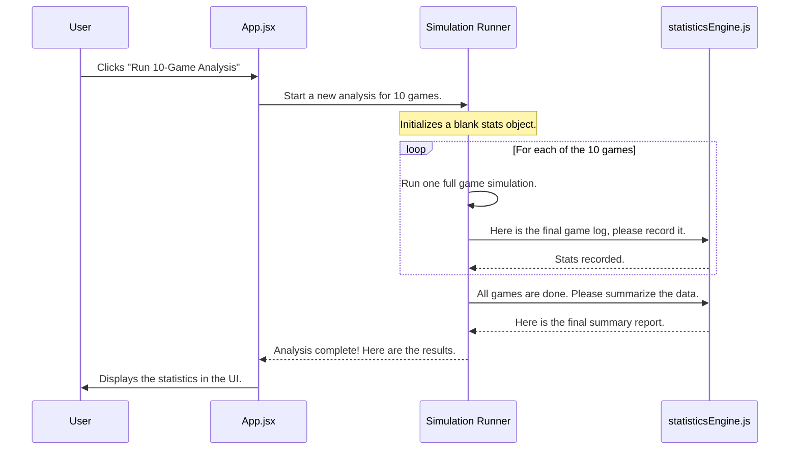

# Chapter 7: Multi-Game Statistical Analysis

In the [previous chapter on Dynamic Card Behavior Analysis](06_dynamic_card_behavior_analysis_.md), we built a system that allows our simulation engine to understand any card's abilities. With this, we can run a single, detailed simulation of our deck.

But one game of Magic is never the whole story. Maybe you got a perfect opening hand and won on turn four. Or maybe you got "mana screwed" and never cast a spell. Was that good luck? Bad luck? Or is that how the deck *usually* performs?

This chapter is about answering that question. We're going to hire a **Sports Statistician** to watch our deck play not just one game, but ten, fifty, or even a hundred games. After the season is over, this statistician will analyze every single play and give us a comprehensive performance report, turning a mountain of raw data into simple, actionable insights.

## The Core Problem: From a Single Game to a Performance Profile

Running one simulation gives you a story. Running a hundred simulations gives you statistics.

A single game log might tell you:
*   "In this game, you won on turn 7."

But a statistical summary can tell you:
*   "Your deck wins on **average** on turn 7.8, has a **win rate** of 65%, and gets stuck on two lands **15% of the time**."

This is the goal of **Multi-Game Statistical Analysis**. We take the raw results from many games and boil them down into key metrics that reveal the deck's true consistency, speed, and power. It's the difference between a single anecdote and a data-driven conclusion.

## Our Statistician's Three-Step Process

Our "Statistician" is the `src/statisticsEngine.js` file. It's a set of tools designed to collect, record, and summarize game data. Here’s how it works.

### 1. The Blank Notebook (`initializeStatistics`)

Before the first game starts, our statistician needs a fresh notebook to record the results. This is what the `initializeStatistics` function does. It creates a blank "state" object, ready to be filled with data.

It's a big, empty template with sections for everything we care about:
*   How many mulligans were taken in each game? `mulligans: []`
*   What turn was the commander cast? `commanderCastTurn: []`
*   Did the game end in a win? `gamesWon: 0`

```javascript
// src/statisticsEngine.js (simplified)

export const initializeStatistics = () => {
  return {
    totalGames: 0,
    mulligans: [],
    winTurn: [],
    gamesWon: 0,
    // ... many other empty fields
  };
};
```
This function gives us a clean slate every time we start a new analysis session.

### 2. The Game Scribe (`recordGameResult`)

After each simulated game, the [Game Simulation Engine](04_game_simulation_engine_.md) hands over its final `gameState` object. The `recordGameResult` function then acts as a scribe, carefully reading the game's log and adding the key facts to our notebook.

If the game ended on turn 8 with 3 mulligans, this function would:
1.  Add `3` to the `mulligans` array.
2.  Add `8` to the `winTurn` array.
3.  Increase `gamesWon` by one.

```javascript
// src/statisticsEngine.js (simplified)

export const recordGameResult = (stats, gameState) => {
  stats.totalGames++;
  
  // Record the number of mulligans for this game
  stats.mulligans.push(gameState.mulliganCount);
  
  // If it was a winning game, record the turn
  if (gameState.isWin) {
    stats.winTurn.push(gameState.turn);
    stats.gamesWon++;
  }

  // ... records many other stats
  return stats; // Return the updated notebook
};
```
This process repeats for every game in the simulation run, filling our notebook with raw data points.

### 3. The Analyst (`calculateSummary`)

After all the games are finished, our notebook might look like this:
*   `mulligans: [1, 0, 2, 0, 1, 1, 0, 0, 2, 1]`
*   `winTurn: [8, 7, 9, 8, 7, 10, 8]`

This is useful, but not very readable. The final step is to analyze this data. The `calculateSummary` function takes the notebook and calculates the final statistics. It turns the raw lists into meaningful numbers.

*   From `mulligans`, it calculates an `avgMulligans` of `0.9`.
*   From `winTurn`, it calculates an `avgWinTurn` of `8.14`.
*   It also calculates rates, like `winRate: "70.0%"` (7 wins out of 10 games).

```javascript
// src/statisticsEngine.js (simplified)

const average = (arr) => {
  if (arr.length === 0) return 0;
  // Sum up all numbers and divide by the count
  return arr.reduce((a, b) => a + b, 0) / arr.length;
};

export const calculateSummary = (stats) => {
  return {
    totalGames: stats.totalGames,
    avgMulligans: average(stats.mulligans).toFixed(1),
    avgWinTurn: average(stats.winTurn).toFixed(2),
    winRate: ((stats.gamesWon / stats.totalGames) * 100) + '%',
    // ... many other calculated metrics
  };
};
```
This final summary object is what gets displayed to you in the user interface, in all those nice-looking charts and tables.

## Under the Hood: From Click to Report

Let's trace the entire journey from the moment you click "Run 10-Game Analysis" to seeing the final report card.



### The Code in Action

The process is kicked off by a button in our UI, located in `src/components/SimulationView.jsx`.

```jsx
// src/components/SimulationView.jsx

<button
  onClick={() => runMultipleGames(10)}
  // ...
>
  ▶ Run 10-Game Analysis
</button>
```
The `runMultipleGames` function in `App.jsx` contains the loop that manages the whole process.

```javascript
// src/App.jsx (simplified)

const runMultipleGames = async (numGames) => {
  // 1. Get a blank notebook
  let stats = initializeStatistics();

  for (let i = 0; i < numGames; i++) {
    // 2. Run a single game
    const gameResult = await runSingleSimulation();
    
    // 3. Record the result in the notebook
    stats = recordGameResult(stats, gameResult);
  }

  // 4. After the loop, create the final summary
  const summary = calculateSummary(stats);
  const textReport = generateReport(stats);
  const healthScore = getDeckHealthScore(stats);
  
  // 5. Save the final results to state to update the UI
  setStatistics({ raw: stats, summary, textReport, healthScore });
};
```
Finally, the `SimulationView.jsx` component receives the final `statistics` object and uses it to display the results in a clean, user-friendly format.

```jsx
// src/components/SimulationView.jsx

// The `summary` object comes from our statistics engine
const summary = statistics.summary;

return (
  // ...
  <div className="p-4 bg-gray-900 rounded">
    <p className="text-xs text-gray-400">Win Rate</p>
    <p className="text-3xl font-bold text-green-400">
      {summary.winRate}
    </p>
  </div>
  // ...
);
```
This elegant flow separates the work cleanly: the **simulation engine** plays the game, the **statistics engine** analyzes the results, and the **UI component** displays them.

## Conclusion

You've now learned how `mtg-goldfisher` transforms the raw chaos of hundreds of game logs into a clear, understandable performance report. By using a dedicated **statistics engine** to **initialize** a data structure, **record** results from each game, and **summarize** them at the end, we can provide powerful, data-driven insights into a deck's performance. This is what allows you to truly test and refine your deck, moving beyond gut feelings to make informed decisions based on hard data.

We have now covered the entire core pipeline of the application, from parsing a decklist to running simulations and analyzing the results. But what happens when something unexpected occurs—an internet connection drops, or an AI call fails? A great application must be prepared for failure.

➡️ **Next Chapter: [Robust Error Handling & Fallbacks](08_robust_error_handling___fallbacks_.md)**

---

Generated by [AI Codebase Knowledge Builder](https://github.com/The-Pocket/Tutorial-Codebase-Knowledge)