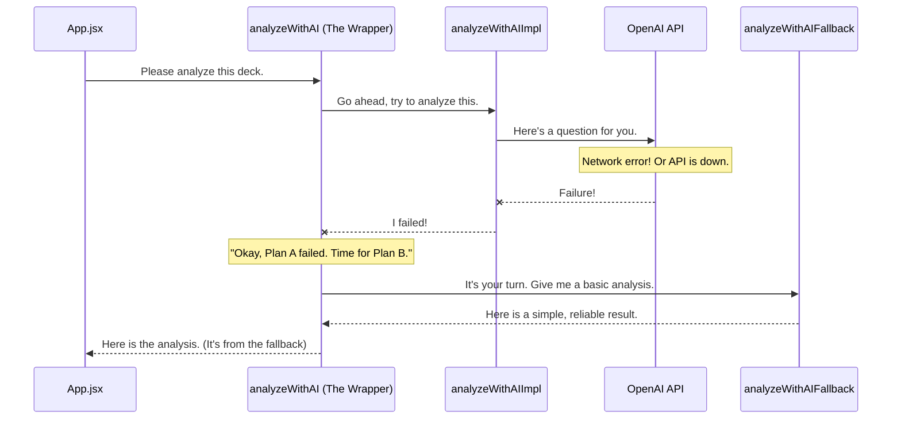

# Chapter 8: Robust Error Handling & Fallbacks

In the [previous chapter on Multi-Game Statistical Analysis](07_multi_game_statistical_analysis_.md), we saw how our application runs hundreds of simulations to give us a detailed performance report. We've now seen the entire pipeline, from pasting a decklist to getting data-driven insights.

But what happens when things go wrong? What if your internet connection drops while the app is trying to talk to the AI? What if the AI service is temporarily down? In a perfect world, everything works all the time. In the real world, things fail.

This final chapter is about building a safety net. It's about making our application resilient, smart, and user-friendly even when the unexpected happens. It's the crucial, final layer that separates a fragile prototype from a robust, professional application.

## The Core Problem: The Internet is Unpredictable

Imagine you've just parsed your deck, and you're excited to see the results. You click the "Analyze with AI" button. The loading spinner appears... and then... nothing. The app freezes or, even worse, crashes with a strange error message. This is a terrible user experience.

The most common reason for this is that the call to the external AI service failed. The internet is a complex place, and connections can be slow, intermittent, or fail entirely.

Our goal with **Robust Error Handling & Fallbacks** is to anticipate these failures. Instead of crashing, our application should:
1.  Recognize that the AI call failed.
2.  Automatically switch to a "Plan B."
3.  Provide a simpler, but still useful, result to the user.
4.  Clearly inform the user that it used a backup plan.

Think of this as the safety net for a trapeze artist. The artist's goal is to complete the trick (the AI call), but the safety net (our error handling) is always there to catch them if they fall, ensuring the show goes on.

## Our Safety Net's Two Key Components

The magic happens inside a dedicated file, `src/errorHandler.js`. It gives us a special tool called `wrapAIFunction` that lets us build this safety net for any function that might fail. Let's break down how it works.

### 1. The Wrapper: The Safety Net Itself

A "wrapper" function is a function that takes *another function* as its input and "wraps" it with extra behavior. Our `wrapAIFunction` is like a protective box. You put your fragile, risky function inside it, and the box adds a layer of protection.

This protective box is programmed with a few simple rules:
*   **Try:** First, try to run the original function.
*   **Retry:** If it fails, maybe it was just a temporary glitch. Wait a second and try again.
*   **Timeout:** If the function is taking way too long, assume it's stuck and stop waiting.
*   **Catch:** If it fails completely after all the retries, don't crash! Catch the error and move to the backup plan.

This wrapper contains all the complex logic for retries and timeouts, so we only have to write it once.

### 2. The Fallback: The Backup Generator

A **fallback** function is our "Plan B." It's a much simpler, dumber, but incredibly reliable function that is guaranteed to work because it doesn't depend on anything external like the internet.

Let's go back to our [AI-Powered Strategic Analysis](03_ai_powered_strategic_analysis_.md).
*   **The Risky Function (`analyzeWithAIImpl`):** This is the function that builds a huge prompt and makes a real network call to the OpenAI API. It's powerful but fragile.
*   **The Fallback Function (`analyzeWithAIFallback`):** This function does *not* call any AI. It just looks at a few basic stats from the deck (like the average mana cost) and returns a very simple, pre-written analysis. It's not as smart, but it's instant and never fails.

The wrapper's job is to try the risky function first, and if (and only if) it fails, run the fallback function instead.

## How We Solve Our Use Case

Let's see how we apply this to make our AI analysis resilient. In `src/aiAnalyzer.js`, we have our two functions.

First, the powerful, internet-dependent AI function we want to run.

```javascript
// src/aiAnalyzer.js

// The main, powerful function that calls the AI.
// This is our "Plan A".
const analyzeWithAIImpl = async (parsedDeck, basicStrategy) => {
  // ...builds a huge prompt...
  
  // This line might fail!
  const analysis = await callOpenAI(...);
  
  return { analysis };
};
```

Second, our super-simple, reliable backup plan that doesn't use the internet.

```javascript
// src/aiAnalyzer.js

// The simple, reliable backup function.
// This is our "Plan B".
const analyzeWithAIFallback = async (parsedDeck, basicStrategy) => {
  console.warn('⚠️ AI analysis failed, using basic strategy');
  
  // Just returns a simple, hard-coded object.
  return {
    analysis: {
      archetype: 'Analysis unavailable - AI error',
      winConditions: ['Combat damage'],
      // ... other basic fields
    },
    usedFallback: true // A flag to tell the UI what happened.
  };
};
```

Finally, we use our `wrapAIFunction` from the error handler to combine them into one, super-resilient function.

```javascript
// src/aiAnalyzer.js

// 1. Import the wrapper tool.
import { wrapAIFunction } from './errorHandler.js';

// 2. Use it to create a new, safe version of our function.
export const analyzeWithAI = wrapAIFunction(
  analyzeWithAIImpl,    // Plan A: The function to try first.
  analyzeWithAIFallback,  // Plan B: The function to use if Plan A fails.
  'analyzeWithAI',      // A name for logging purposes.
  { retryCount: 1 }    // An option: try Plan A twice before giving up.
);
```
That's it! Now, everywhere else in our application, we can call `analyzeWithAI` without worrying. The safety net is built-in. If the AI call works, we get a detailed analysis. If it fails, we get the basic fallback analysis instead of a crash.

## Under the Hood

Let's visualize the "unhappy path"—what happens when the AI call fails.



The magic inside the wrapper is a core concept in many programming languages called a `try...catch` block. Let's look at a simplified version of `wrapAIFunction` from `src/errorHandler.js`.

```javascript
// src/errorHandler.js (simplified)

export const wrapAIFunction = (fn, fallbackFn) => {
  // It returns a new function that has the safety net built in.
  return async (...args) => {
    try {
      // TRY to run the main function ("Plan A").
      const result = await fn(...args);
      return { success: true, ...result };
      
    } catch (error) {
      // If it fails, CATCH the error and don't crash.
      console.error("The main function failed:", error.message);
      
      // Now, run the fallback function ("Plan B").
      const fallbackResult = await fallbackFn(...args);
      return { success: true, usedFallback: true, ...fallbackResult };
    }
  };
};
```
This simple `try...catch` structure is the heart of our safety net. Our real `wrapAIFunction` is a bit more complex because it also includes logic for retries and timeouts, but the core principle is the same. It creates a robust boundary that prevents errors in one part of the system (like an external API) from crashing the entire application.

## Conclusion

You now understand the final, critical piece of the `mtg-goldfisher` architecture. Robust applications aren't just about powerful features; they're about how gracefully they handle failure. By using a centralized **error handler** to **wrap** our fragile, external-facing functions, we can provide reliable **fallbacks** that ensure a smooth user experience, no matter what. This "safety net" philosophy is what makes our application dependable and professional.

This concludes our journey through the core concepts of `mtg-goldfisher`. You've seen how we handle everything from the user interface to deck parsing, AI analysis, game simulation, and now, error handling. You now have a complete, high-level map of the entire application and the principles that guide its design.

Thank you for following along. We hope this tour has been helpful, and we're excited to see what you build

---

Generated by [AI Codebase Knowledge Builder](https://github.com/The-Pocket/Tutorial-Codebase-Knowledge)