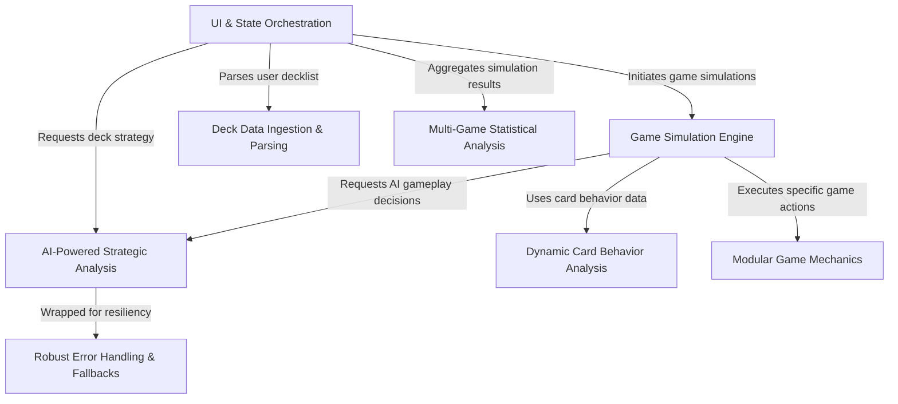

# Tutorial: mtg-goldfisher

`mtg-goldfisher` is a powerful tool designed to help you **test and improve your Magic: The Gathering Commander decks**. You simply *paste in a decklist*, and the application uses an AI to analyze its core strategy, identify win conditions, and suggest improvements. It then runs hundreds of *simulated solo games* (a process known as "goldfishing") to gather **detailed performance statistics**, showing you how consistently your deck can execute its game plan and highlighting potential weaknesses before you play against real opponents.

**Source Repository:** [https://github.com/Tomoda826/mtg-goldfisher](https://github.com/Tomoda826/mtg-goldfisher)

## Chapters

1. [UI & State Orchestration
](01_ui___state_orchestration_.md)
2. [Deck Data Ingestion & Parsing
](02_deck_data_ingestion___parsing_.md)
3. [AI-Powered Strategic Analysis
](03_ai_powered_strategic_analysis_.md)
4. [Game Simulation Engine
](04_game_simulation_engine_.md)
5. [Modular Game Mechanics
](05_modular_game_mechanics_.md)
6. [Dynamic Card Behavior Analysis
](06_dynamic_card_behavior_analysis_.md)
7. [Multi-Game Statistical Analysis
](07_multi_game_statistical_analysis_.md)
8. [Robust Error Handling & Fallbacks
](08_robust_error_handling___fallbacks_.md)

---

Generated by [AI Codebase Knowledge Builder](https://github.com/The-Pocket/Tutorial-Codebase-Knowledge)